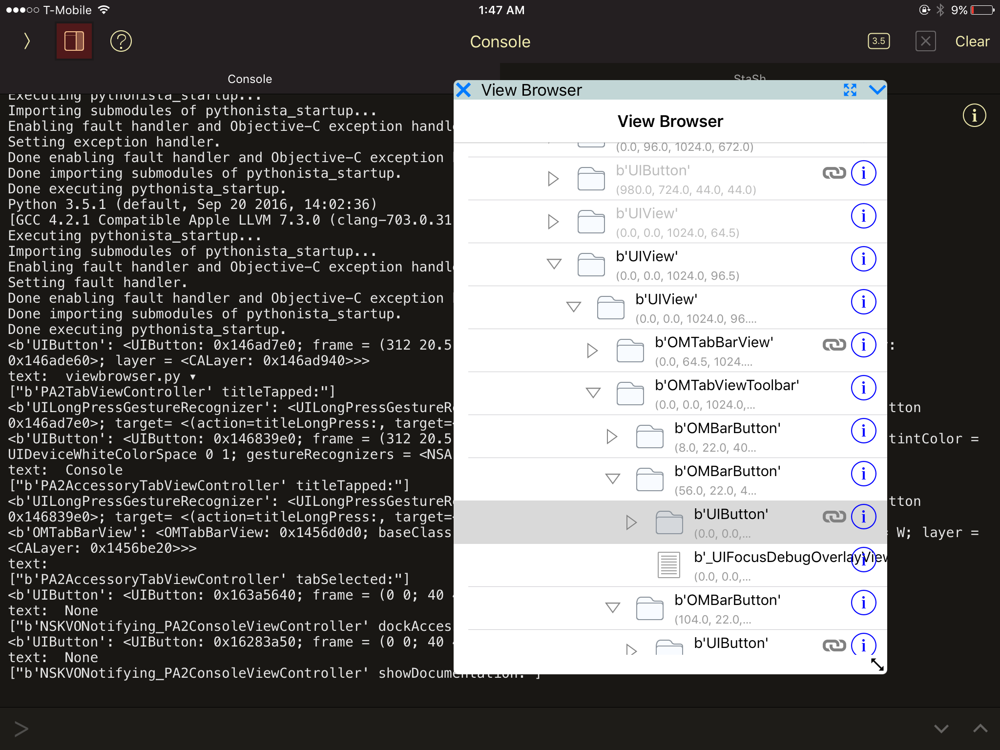
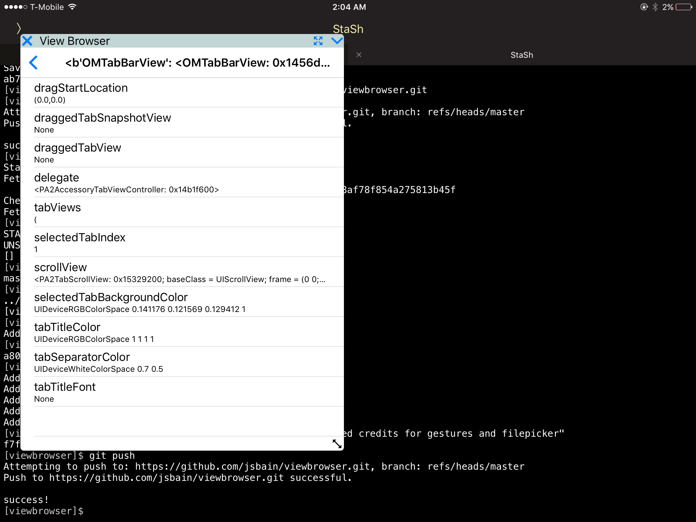

# viewbrowser
## simple view heirarchy browser for pythonista

Inspired by the hidden debug view overlay, this is an overlay that allows exploration of the UIView heirarchy.  Add to wrench menu for easy access.

Tapping a view highlights the view in red.  Expanding a view shows its subviews.

The info button opens an objc object browser, which shows all of the properties of the instance.  Tapping on a property that is an ObjCInstance opens that object in the object browser.

Note this works by storing addresses, not retained objects, so in some cases trying to browse an object which has already been released results in a segfault.  For instance, _mapKit_currentLayer always produces a new instance, so tapping this usually results in a crash.  There is not a great way to solve this, short of retaining every property we visit, which might be a bad idea..

